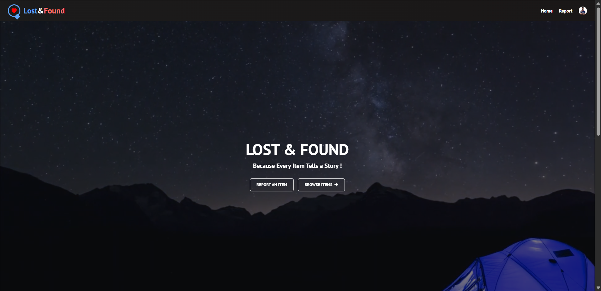
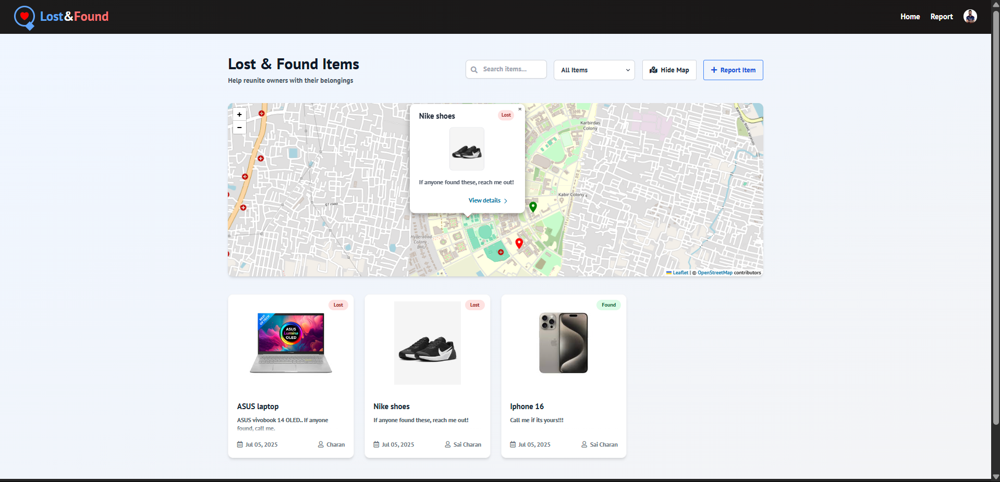
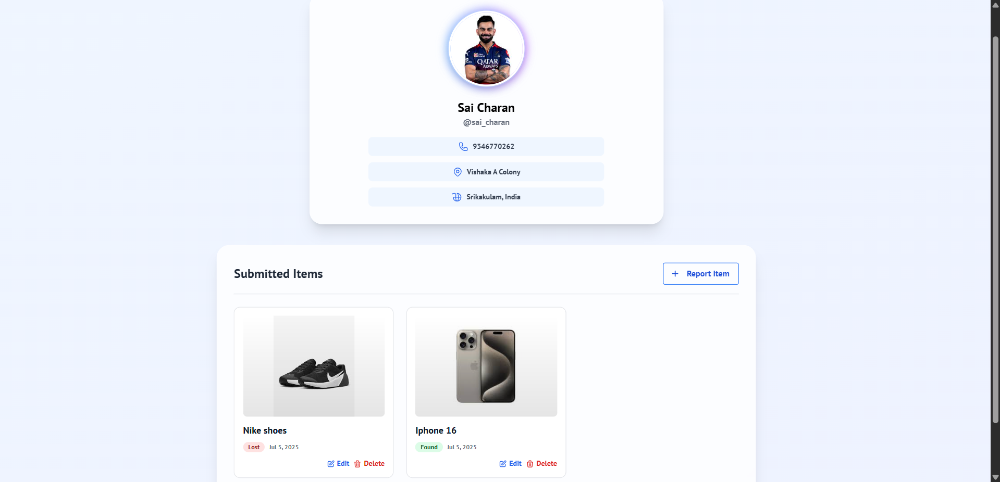

# 🧳 Lost & Found Campus Platform

[)](https://tscharan.pythonanywhere.com)

A full-stack web application that helps students and staff report, search, and manage lost and found items across campus.

---

## ✨ Key Features

| Feature | Description |
|---------|-------------|
| 🔐 **User Authentication** | Secure signup/login with profile management |
| 📍 **Map-Based Search** | Interactive map with geolocation for items |
| 📸 **Media Uploads** | Image uploads for better identification |
| 🔍 **Smart Filters** | Filter by keywords |
| 📱 **Mobile-Friendly** | Responsive design for all devices |

---
## 📸 Screenshots

| Page | Screenshot |
|------|------------|
| Homepage |  |
| Item Map |  |
| User Profile |  |

---

## 🛠️ Tech Stack

**Backend:**
- Django 4.2
- Python 3.10
- SQLite

**Frontend:**
- Tailwind CSS
- HTML5
- JavaScript (Vanilla)

**Deployment:**
- PythonAnywhere
- WhiteNoise (Static files)

---

## 🚀 Local Development

1. **Clone the repo**
   ```bash
   git clone https://github.com/CherryVK18/lostnfound.git
   cd lostfound
   ```

2. **Set up virtual environment**
   ```bash
   python -m venv venv
   source venv/bin/activate  # Linux/Mac
   venv\Scripts\activate    # Windows
   ```

3. **Install dependencies**
   ```bash
   pip install -r requirements.txt
   ```

4. **Configure environment**
   ```bash
   cp .env.example .env
   # Edit .env with your settings
   ```

5. **Run migrations**
   ```bash
   python manage.py migrate
   python manage.py createsuperuser
   ```

6. **Start development server**
   ```bash
   python manage.py runserver
   ```

Visit `http://localhost:8000`

---

## 📂 Project Structure

```bash
lostfound/
├── items/            # Item models and views
├── users/            # Authentication system
├── main/             # Core pages
├── static/           # CSS, JS, images
├── templates/        # HTML templates
├── lostfound/        # Project settings
└── manage.py         # Django CLI
```

---

## 👨‍💻 Author

* T. Sai Charan – [LinkedIn](https://www.linkedin.com/in/sai-charan-tarra)

---

## 🙌 Acknowledgments

- Django Documentation
- PythonAnywhere Team
- Tailwind CSS Community
- All Beta Testers
